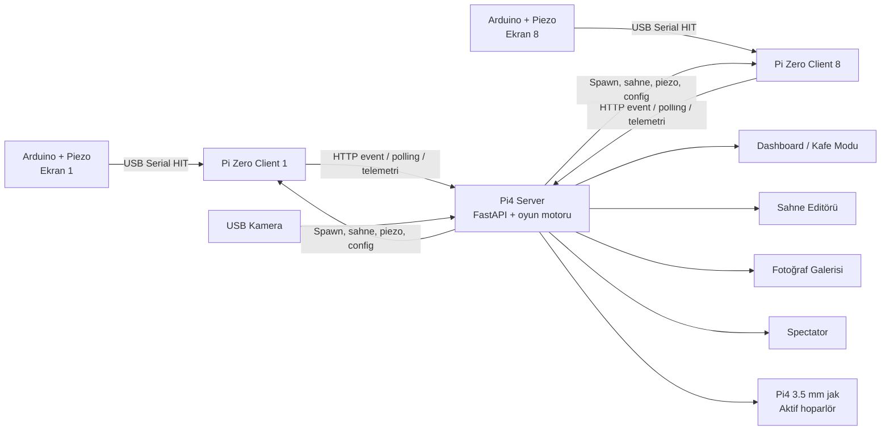

# Polis Oyunu — Sistem Kurulum, İşletim ve Güncelleme Rehberi

Bu belge Polis Oyunu sisteminin tamamını tek yerde açıklar: mimari, oyun akışı, repository konumları, Pi4 server kurulumu, sekiz Pi Zero 2 W client kurulumu, spectator, dashboard, sahne editörü, ses, kamera, fotoğraf galerisi, güvenli güncelleme, yedekleme ve sorun giderme.

> Bu dosyaya Wi-Fi parolası, operatör PIN’i, müşteri bilgisi veya Tailscale anahtarı yazmayın. Örneklerdeki `<...>` alanlarını kendi ortamınıza göre doldurun.

## İçindekiler

1. [Sistem özeti](#1-sistem-özeti)
2. [Mimari ve veri akışı](#2-mimari-ve-veri-akışı)
3. [Oyun nasıl çalışır?](#3-oyun-nasıl-çalışır)
4. [Repository ve kurulum dizinleri](#4-repository-ve-kurulum-dizinleri)
5. [Ağ, hostname, mDNS ve Tailscale](#5-ağ-hostname-mdns-ve-tailscale)
6. [Pi4 serverı ilk kez kurma](#6-pi4-serverı-ilk-kez-kurma)
7. [Pi Zero clientı ilk kez kurma](#7-pi-zero-clientı-ilk-kez-kurma)
8. [Windows SD kart hazırlama aracı](#8-windows-sd-kart-hazırlama-aracı)
9. [Spectator kurulumu](#9-spectator-kurulumu)
10. [Systemd ve otomatik açılış](#10-systemd-ve-otomatik-açılış)
11. [Dashboard ve operatör ekranları](#11-dashboard-ve-operatör-ekranları)
12. [Dashboarddan client ayarı](#12-dashboarddan-client-ayarı)
13. [Sahne editörü](#13-sahne-editörü)
14. [Merkezi ses ve müzik](#14-merkezi-ses-ve-müzik)
15. [USB kamera ve fotoğraf sistemi](#15-usb-kamera-ve-fotoğraf-sistemi)
16. [Kod güncelleme ve yayınlama](#16-kod-güncelleme-ve-yayınlama)
17. [Client güvenli güncelleme mekanizması](#17-client-güvenli-güncelleme-mekanizması)
18. [Config ve çalışma verileri](#18-config-ve-çalışma-verileri)
19. [Yedekleme ve elektrik kesintisi kurtarma](#19-yedekleme-ve-elektrik-kesintisi-kurtarma)
20. [Test ve saha kabul kontrolü](#20-test-ve-saha-kabul-kontrolü)
21. [Sorun giderme](#21-sorun-giderme)
22. [Günlük operasyon özeti](#22-günlük-operasyon-özeti)

---

## 1. Sistem özeti

Sistem üç ana uygulamadan oluşur:

| Bileşen | Donanım | Görevi |
|---|---|---|
| Server | Raspberry Pi 4 2 GB | Oyun oturumu, skor, sekiz ekran kotası, sahneler, ses, kamera, fotoğraf galerisi, dashboard ve güncellemeler |
| Client | 8 × Raspberry Pi Zero 2 W | Her ekranda Pygame sahnesini çizmek, Arduino/piezo vuruşunu okumak, serverdan spawn/sahne/config almak |
| Spectator | Pi4 veya ayrı Raspberry Pi | Toplam skoru ve oyun durumunu büyük ekranda göstermek |

Temel kararlar:

- Oyun her zaman **8 ekranlık** oturum açar. Yalnızca bir client bağlı olsa bile oyun başlayabilir.
- Her ekranın vurması gereken hırsız kotası ayrıdır.
- Ekran kendi kotasını bitirdiğinde yeni hırsız gelmez ve `jail` sahnesine geçer.
- Oyun sesi clientlardan çıkmaz. Müzik ve efektler Pi4 serverın 3.5 mm analog jakından çıkar.
- USB kamera Pi4’e bağlıdır. Bir ekran kotasını bitirdiğinde oturum fotoğrafı çekilebilir.
- Clientlar elektrik kesilince, uygulama kapanınca veya crash olunca systemd tarafından tekrar açılır.
- Server kodu bir Git checkout’tur; serverda `git pull` yapılabilir.
- Clientın çalışan `/opt/polisoyunu` dizini Git checkout değildir. Client güncellemesi dashboarddaki güvenli updater ile yapılır.

---

## 2. Mimari ve veri akışı



### Client → server

Client şu verileri gönderir:

- Kabul edilen vuruş eventi: `POST /event`
- Ekran kimliği
- FPS, RAM, sıcaklık ve render telemetrisi
- Arduino/seri bağlantı durumu
- Sahne ekran görüntüsü isteğine verilen PNG
- Client uygulama sürümü ve updater durumu

Her skor eventinin benzersiz `event_id` değeri vardır. Aynı event ağ problemi nedeniyle tekrar gönderilirse server ikinci kez saymaz.

### Server → client

Client normal polling sırasında şunları alır:

- Spawn komutu
- Aktif oyun fazı ve kalan süre
- Ekrana ait skor, hedef ve kalan kota
- Yayınlanmış sahne belgesi ve asset bilgileri
- Piezo threshold/refractory ayarı
- Güvenli restart/update komutu
- Dashboarddan kaydedilen client performans/playarea ayarı

Skor eventleri ağ kesildiğinde clientta kuyruklanır ve bağlantı geri gelince tekrar gönderilir.

---

## 3. Oyun nasıl çalışır?

### Oturum başlangıcı

1. Operatör dashboard veya `/operator` sayfasından oturum adı, çocuk sayısı, süre ve zorluk seçer.
2. Server 8 ekranın her biri için bağımsız hedef hesaplar.
3. Clientlarda `HIRSIZLARI VUR` sahnesi açılır.
4. Ardından 3–2–1 geri sayımı gösterilir ve merkezi ses efektleri çalar.
5. Geri sayım bitince server spawn dağıtmaya ve Pi4 müziği loop olarak çalmaya başlar.

### Ekran kotası

Varsayılan hesap çocuk sayısı, zorluk ve süreye göre yapılır. İlgili server config alanları:

```json
{
  "hits_per_child_per_screen": 6,
  "minimum_hits_per_screen": 12,
  "game_duration_minutes": 35
}
```

Her ekran en az `minimum_hits_per_screen` kadar hırsız vurur. Bir ekran kotasını bitirdiğinde:

- O ekrandaki spawn kuyruğu temizlenir.
- Yeni vuruşlar skora eklenmez.
- `jail` sahnesi açılır.
- Fotoğraf sistemi açıksa Pi4 USB kameradan o ekran tamamlanma fotoğrafını çeker.
- Diğer ekranlar kendi kotaları bitene veya süre dolana kadar devam eder.

### Kazanma ve kaybetme

- Sekiz ekranın tamamı kendi kotasını bitirirse oyun kazanılır.
- Süre dolduğunda tamamlanmamış ekran varsa kaybetme sahnesi gösterilir.
- Sonuç sahnesi `result_scene_seconds` süresince görünür.
- Aktif oturum her kabul edilen vuruştan sonra diske checkpoint olarak yazılır.

---

## 4. Repository ve kurulum dizinleri

### GitHub repository

```text
https://github.com/burakbagoglu/PoliceGame2D.git
```

Ana branch:

```text
main
```

### Geliştirme bilgisayarı

Mevcut Windows çalışma dizini:

```text
C:\Users\burak\Desktop\projects\polisoyunu
```

### Kafedeki Pi4 server

Mevcut kurulumda Git repository:

```text
/home/server1234/Desktop/PoliceGame2D
```

Server uygulaması:

```text
/home/server1234/Desktop/PoliceGame2D/thief_server/main.py
```

Spectator uygulaması:

```text
/home/server1234/Desktop/PoliceGame2D/thief_spectator/screen.py
```

### Pi Zero client

Kaynak Git checkout — manuel `git pull` gerekirse kullanılan yer:

```text
/home/zeropi/PoliceGame2D
```

Çalışan production kopyası:

```text
/opt/polisoyunu/thief_client
```

Client config:

```text
/opt/polisoyunu/thief_client/config.json
```

> `/opt/polisoyunu` içinde `.git` bulunmaması normaldir. Burada `git pull` çalıştırmayın. Kaynak checkout `/home/zeropi/PoliceGame2D`, çalışan release ise `/opt/polisoyunu` dizinidir.

### Repository yapısı

```text
PoliceGame2D/
├── thief_server/       # Pi4 FastAPI server, dashboard, ses, kamera, sahneler
├── thief_client/       # Pi Zero Pygame client ve güvenli updater
├── thief_spectator/    # Hafif Pygame seyir ekranı
├── sd_card_tool/       # Windows PySide6 SD kart hazırlama aracı
├── PRODUCTION.md       # Production notları
├── DASHBOARD_GUIDE.md  # Dashboard kullanım rehberi
├── SCENE_EDITOR_GUIDE.md
└── SISTEM_KURULUM_VE_ISLETIM_REHBERI.md
```

---

## 5. Ağ, hostname, mDNS ve Tailscale

### Yerel ağ

- Pi4 ve tüm Pi Zero cihazlar aynı yerel ağda olmalıdır.
- Pi Zero 2 W yalnızca 2.4 GHz Wi-Fi kullanır.
- Pi4 için DHCP reservation veya sabit IP önerilir.
- Hostname ile erişim için `avahi-daemon` ve `libnss-mdns` kurulur.

Önerilen server adresi:

```text
http://server.local:8078
```

Client event adresi:

```text
http://server.local:8078/event
```

Health testi:

```bash
curl http://server.local:8078/health
```

`.local` çözülmezse önce IP ile test edin:

```bash
hostname -I
curl http://<PI4_YEREL_IP>:8078/health
```

### Client hostname

Manuel kurulumda önerilen hostname yapısı:

```text
client1.local
client2.local
...
client8.local
```

Değiştirmek için:

```bash
sudo hostnamectl set-hostname client3
sudo reboot
```

Windows SD kart aracı varsayılan olarak `polis-ekran-N` hostname’i oluşturabilir. Bu durumda SSH adresi örneğin `polis-ekran-3.local` olur.

### Tailscale

Tailscale yalnızca uzaktan Pi4’e erişmek için gereklidir. Pi Zero cihazlarda Tailscale kurmak zorunlu değildir.

Evden tipik erişim:

```bash
ssh server1234@<PI4_TAILSCALE_IP>
```

Sonra Pi4 üzerinden kafe LAN’ındaki clienta geçilir:

```bash
ssh zeropi@client6.local
```

Pi4 Tailscale adresini görmek için:

```bash
tailscale ip -4
tailscale status
```

---

## 6. Pi4 serverı ilk kez kurma

### 6.1 İşletim sistemi

Önerilen:

- Raspberry Pi OS Bookworm
- Pi4 2 GB veya daha yüksek
- SSH açık
- Pi4 hostname: `server`
- Aynı LAN’a Ethernet veya Wi-Fi ile bağlı

### 6.2 Repository klonlama

Pi4 terminalinde:

```bash
cd /home/server1234/Desktop
git clone --depth 1 --single-branch --branch main \
  https://github.com/burakbagoglu/PoliceGame2D.git
cd /home/server1234/Desktop/PoliceGame2D
```

Repository zaten varsa:

```bash
cd /home/server1234/Desktop/PoliceGame2D
git status
git pull --ff-only origin main
```

### 6.3 Server bağımlılıkları

```bash
cd /home/server1234/Desktop/PoliceGame2D/thief_server
bash setup_server.sh
```

Script şunları kurar:

- Python, Pygame ve FastAPI gereksinimleri
- ALSA araçları
- `fswebcam` ve `v4l2` kamera araçları
- Avahi/mDNS
- Fotoğraf galerisi operatör PIN’i
- Server systemd servisi
- Günlük backup timerı

### 6.4 Mevcut `server1234` kurulumu için systemd override

Repository içindeki temel servis şablonu `/home/pi/thief_server` ve `User=pi` varsayar. Kafedeki gerçek repository başka yerde olduğu için override zorunludur.

```bash
sudo systemctl edit thief-server.service
```

Açılan editöre:

```ini
[Service]
User=server1234
WorkingDirectory=/home/server1234/Desktop/PoliceGame2D/thief_server
Environment=
Environment=PYTHONUNBUFFERED=1
Environment=THIEF_SERVER_CONFIG=/home/server1234/Desktop/PoliceGame2D/thief_server/config.json
Environment=SDL_AUDIODRIVER=alsa
ExecStart=
ExecStart=/usr/bin/python3 -u /home/server1234/Desktop/PoliceGame2D/thief_server/main.py
Restart=always
RestartSec=3
```

Backup servisi için:

```bash
sudo systemctl edit thief-server-backup.service
```

```ini
[Service]
WorkingDirectory=/home/server1234/Desktop/PoliceGame2D/thief_server
ExecStart=
ExecStart=/home/server1234/Desktop/PoliceGame2D/thief_server/backup_server.sh
```

Uygula:

```bash
chmod +x /home/server1234/Desktop/PoliceGame2D/thief_server/backup_server.sh
sudo systemctl daemon-reload
sudo systemctl enable thief-server.service
sudo systemctl enable --now thief-server-backup.timer
sudo systemctl restart thief-server.service
```

### 6.5 Server kontrolü

```bash
systemctl is-enabled thief-server.service
systemctl is-active thief-server.service
sudo systemctl status thief-server.service --no-pager -l
sudo journalctl -b -u thief-server.service -n 60 --no-pager
curl http://localhost:8078/health
```

Beklenen:

```text
enabled
active
```

### 6.6 Operatör PIN’i

PIN şurada tutulur:

```text
/etc/police-game/photos.env
```

Görmek için:

```bash
sudo grep '^THIEF_PHOTO_ADMIN_PIN=' /etc/police-game/photos.env
```

Dosya `root:root` ve `0600` olmalıdır. PIN’i Git repository’ye yazmayın.

---

## 7. Pi Zero clientı ilk kez kurma

Bu bölüm her Pi Zero 2 W için ayrı uygulanır. `N` yerine 1–8 ekran numarası yazılır.

### 7.1 İşletim sistemi

Önerilen:

- Raspberry Pi OS Lite/Console veya Bookworm
- Kullanıcı: `zeropi`
- SSH açık
- 2.4 GHz Wi-Fi
- HDMI ekran Pi açılırken bağlı

### 7.2 Repository klonlama

```bash
cd /home/zeropi
git clone \
  --depth 1 \
  --single-branch \
  --branch main \
  --filter=blob:none \
  --no-tags \
  https://github.com/burakbagoglu/PoliceGame2D.git \
  /home/zeropi/PoliceGame2D
```

Doğrula:

```bash
cd /home/zeropi/PoliceGame2D
git log -1 --oneline
test -f thief_client/setup_pi.sh && echo OK
```

### 7.3 Kurulum scripti

Client 3 örneği:

```bash
cd /home/zeropi/PoliceGame2D

sudo bash thief_client/setup_pi.sh \
  --screen-id 3 \
  --server server.local \
  --user zeropi \
  --skip-apt-update
```

İlk cihazda paket listesinin güncellenmesi gerekiyorsa `--skip-apt-update` kullanmayın.

Arduino `/dev/ttyACM0` ise:

```bash
sudo bash thief_client/setup_pi.sh \
  --screen-id 3 \
  --server server.local \
  --serial-port /dev/ttyACM0 \
  --user zeropi
```

Wi-Fi’ı da script ile ayarlamak için:

```bash
sudo bash thief_client/setup_pi.sh \
  --screen-id 3 \
  --server server.local \
  --user zeropi \
  --wifi-ssid "<SSID>" \
  --wifi-password "<PAROLA>" \
  --wifi-country TR
```

Script:

- Gerekli paketleri kurar.
- Projeyi `/opt/polisoyunu` altına kopyalar.
- Cihaza özel config’i korur/yedekler.
- `screen_id`, server ve Arduino portunu ayarlar.
- Pi Zero 1280×720 adaptif kalite profilini açar.
- Kullanıcıyı `video`, `render`, `dialout` gibi gruplara ekler.
- `thief-game.service` servisini oluşturur.
- Güvenli updater servisini ve sınırlı sudoers kuralını kurar.
- Elektrik kesilince otomatik açılmayı etkinleştirir.

### 7.4 Masaüstünü kapatmak — KMSDRM için zorunlu

Client Pygame’i doğrudan DRM/KMS üzerinde çalıştırır. Raspberry Pi masaüstü (`labwc`, `wayfire`, `Xorg`, `lightdm`) ekran kartını tutarsa `kmsdrm not available` hatası oluşur veya üst panel oyun alanını keser.

Her clientta bir kere:

```bash
sudo systemctl enable thief-game.service
sudo systemctl set-default multi-user.target
sudo systemctl disable lightdm.service 2>/dev/null || true
sudo reboot
```

`display-manager.service` alias’ı kullanılıyorsa şu komut `Unit not loaded` diyebilir; link kaldırıldıysa bu hata değildir:

```bash
sudo systemctl disable --now display-manager.service
```

Reboot sonrası:

```bash
systemctl get-default
systemctl is-active display-manager.service
systemctl is-active thief-game.service
```

Beklenen:

```text
multi-user.target
inactive
active
```

### 7.5 Client doğrulama

```bash
grep -E '"screen_id"|"server_url"' \
  /opt/polisoyunu/thief_client/config.json

systemctl is-enabled thief-game.service
systemctl is-active thief-game.service
sudo journalctl -b -u thief-game.service -n 40 --no-pager
curl http://server.local:8078/health
```

Dashboardda ilgili ekran birkaç saniye içinde `Bağlı` görünmelidir.

### 7.6 Wi-Fi’a yalnızca hızlı bağlanma

```bash
sudo nmcli device wifi connect "<SSID>" password "<PAROLA>" ifname wlan0
```

Kontrol:

```bash
nmcli device status
hostname -I
ping -c 3 server.local
sudo systemctl restart thief-game.service
```

---

## 8. Windows SD kart hazırlama aracı

Sekiz kartı tek tek elle kurmak yerine `sd_card_tool` kullanılabilir.

Windows’ta:

```text
sd_card_tool\start_windows.bat
```

Araç:

- Raspberry Pi OS Lite 32-bit imajını yazar.
- Yalnız çıkarılabilir diskleri listeler.
- Wi-Fi, hostname, kullanıcı, SSH, ekran ID, server ve Arduino portunu ayarlar.
- Client kaynaklarını karta gömer.
- İlk bootta paketleri kurar ve `thief-game.service` servisini etkinleştirir.

İlk açılış 5–15 dakika sürebilir. Log:

```bash
sudo cat /var/log/polisoyunu-firstboot.log
sudo systemctl status thief-game.service
sudo journalctl -u thief-game.service -n 100 --no-pager
```

Başarılı provisioning işareti:

```text
/var/lib/polisoyunu/provisioned.json
```

Ayrıntı: [sd_card_tool/README.md](sd_card_tool/README.md)

---

## 9. Spectator kurulumu

Spectator toplam skor ve oyun durumunu gösteren hafif Pygame uygulamasıdır. Tarayıcıdaki `/screen` sayfası da alternatif olarak kullanılabilir.

### 9.1 Pi4 üzerindeki mevcut kurulum

Config:

```json
{
  "server_base_url": "http://localhost:8078",
  "fullscreen": true,
  "fps": 30
}
```

Servis override:

```bash
sudo systemctl edit thief-spectator.service
```

```ini
[Service]
User=server1234
WorkingDirectory=/home/server1234/Desktop/PoliceGame2D/thief_spectator
ExecStart=
ExecStart=/usr/bin/python3 -u /home/server1234/Desktop/PoliceGame2D/thief_spectator/screen.py
Restart=always
RestartSec=3
Environment=
Environment=PYTHONUNBUFFERED=1
Environment=SDL_VIDEODRIVER=kmsdrm
Environment=SDL_VIDEO_ALLOW_SCREENSAVER=0
```

Uygula:

```bash
sudo systemctl daemon-reload
sudo systemctl enable thief-spectator.service
sudo systemctl restart thief-spectator.service
sudo systemctl status thief-spectator.service --no-pager
```

KMSDRM spectator kullanılıyorsa Pi4’te de masaüstü yerine `multi-user.target` gerekir.

### 9.2 Tarayıcı spectator

```text
http://server.local:8078/screen
```

Bu yöntem daha kolaydır ancak Chromium daha fazla RAM tüketir.

---

## 10. Systemd ve otomatik açılış

### Servisler

| Servis | Cihaz | Açıklama |
|---|---|---|
| `thief-server.service` | Pi4 | FastAPI server |
| `thief-server-backup.timer` | Pi4 | Günlük yedek |
| `thief-spectator.service` | Pi4/ayrı cihaz | Pygame skor ekranı |
| `thief-game.service` | Pi Zero | Oyun clientı |
| `thief-game-update.service` | Pi Zero | Root yetkili tek seferlik güvenli updater |

Ana servislerde:

```ini
Restart=always
StartLimitIntervalSec=0
```

Bu nedenle:

- Uygulama normal kapansa bile açılır.
- Crash olursa birkaç saniye içinde açılır.
- Elektrik gidip gelince boot sırasında açılır.
- Çok sayıda crash sonrası systemd yeniden başlatmayı bırakmaz.

### Genel servis kontrolü

```bash
systemctl is-enabled <SERVIS>
systemctl is-active <SERVIS>
sudo systemctl status <SERVIS> --no-pager -l
sudo journalctl -b -u <SERVIS> -n 100 --no-pager
sudo systemctl restart <SERVIS>
```

`active` sağlıklıdır. Uzun süre `activating` görünmesi genellikle uygulamanın crash olup restart döngüsüne girdiği anlamına gelir; journal kontrol edilmelidir.

---

## 11. Dashboard ve operatör ekranları

Pi4 adresi `server.local` ise:

| Sayfa | Adres | Kullanım |
|---|---|---|
| Dashboard | `http://server.local:8078/dashboard` | Teknik kontrol ve oyun yönetimi |
| Kafe modu | `http://server.local:8078/operator` | Personelin hızlı oyun başlatması |
| Kafe alias | `http://server.local:8078/kafe` | Aynı hızlı başlangıç sayfası |
| Fotoğraflar | `http://server.local:8078/photos` | Oturum galerisi, satış, indirme ve yazdırma |
| Sahne editörü | `http://server.local:8078/scene-editor` | Sahne ve UI tasarımı |
| Spectator | `http://server.local:8078/screen` | Büyük skor ekranı |
| Health | `http://server.local:8078/health` | Server sağlık kontrolü |

### Dashboard

Dashboarddan:

- Oyun başlatılır/bitirilir.
- Oturum adı, çocuk sayısı, süre ve zorluk seçilir.
- 8 ekranın skor/kota durumu izlenir.
- FPS, P95, RAM, sıcaklık, seri bağlantı ve render yolu görülür.
- Piezo threshold ve refractory ayarlanır.
- Pi4 müzik/efekt sesleri ayarlanır ve test edilir.
- Client restart ve güvenli update komutu verilir.
- Client performans/playarea ayarları kaydedilir.
- Kamera/ses/client saha kontrolü çalıştırılır.

Ses ve piezo dashboard ayarları artık `thief_server/config.json` içine atomik olarak kaydedilir; server restart sonrası kaybolmaz.

### Kafe modu

Kafe personeli vardiya başında bir kez operatör PIN’i girer. Oturum yaklaşık 8 saat geçerlidir.

Personel:

- Oturum/grup adını girer.
- Çocuk sayısını seçer.
- Profili seçer.
- Büyük başlat düğmesine basar.
- Aktif oyunu görebilir ve bitirebilir.

Kafe modu fotoğraf izninin işletme tarafından daha önce alındığını varsayar. İzin prosedürü uygulanmadan fotoğraf özelliğini kullanmayın.

Ayrıntı: [DASHBOARD_GUIDE.md](DASHBOARD_GUIDE.md)

---

## 12. Dashboarddan client ayarı

Yeni client ayar sistemi iki taraflıdır:

- Server ayarı `thief_server/client_settings.json` içinde sürümlü ve kalıcı saklar.
- Client polling sırasında yeni revizyonu alır.
- Client yalnız izin verilen alanları doğrular.
- `/opt/polisoyunu/thief_client/config.json` geçici dosya + `fsync` + `os.replace` ile atomik güncellenir.
- Client kontrollü biçimde kapanır ve systemd tarafından yeniden açılır.
- Client çevrimdışıysa ayar serverda bekler; bağlanınca uygulanır.

Dashboarddan ayarlanabilenler:

- Performans profili: `pi_zero_2w`, `balanced`, `high`
- FPS sınırı
- İç render çözünürlüğü
- Minimum FPS hedefi
- Adaptif kalite
- Playarea açık/kapalı
- Piksel veya fiziksel ölçü modu
- Playarea konumu, boyutu, hizalaması ve boşlukları
- Seçili ekran veya 8 ekranın tamamı

Dashboarddan özellikle değiştirilmeyenler:

- Screen ID
- Server URL
- Wi-Fi
- Linux kullanıcısı
- Seri port

Bu alanlar yanlış değiştirilirse cihaz bağlantısı kaybolabileceği için ilk kurulum/script tarafından yönetilir.

Client sürüm etiketi:

```text
scene-engine-v9-remote-config
```

Eski client yeni config payloadını uygulamaz. Bu özellik ilk kez kurulurken server ve clientların ikisi de güncellenmelidir. Sonraki config değişikliklerinde Git update gerekmez.

---

## 13. Sahne editörü

Sahne editörü serverda çalışan, Photoshop benzeri bir oyun ekranı düzenleyicisidir.

Temel özellikler:

- Seçim, sürükleme, resize ve rotate
- Çoklu seçim ve seçim dikdörtgeni
- Katman sırası, klasör, kilit ve gizleme
- Grid, snap, cetvel ve kılavuzlar
- Gruplar ve prefablar
- Timeline ve keyframe animasyonları
- Fade, slide ve zoom geçişleri
- Skor, süre, isabet, kazanma/kaybetme koşulları
- Merkezi ses timeline’ı
- Sprite-sheet editörü
- Vuruş alanı ve hareket yolu
- Pi Zero performans bütçesi uyarıları
- Taslak otomatik kayıt, revision conflict koruması
- Yayın geçmişi ve geri alma
- Gerçek clienttan tek kare ekran görüntüsü alma

### Taslak ve yayın

- Editördeki değişiklikler önce taslaktır.
- Otomatik kayıt server taslağına yazar.
- Clientları değiştirmek için ayrıca **Yayınla** düğmesine basılır.
- Yayınlanan sahne versiyonlanır.
- Eski sürüm taslağa alınabilir ve yeniden yayınlanabilir.

### Client asset cache

Yayınlanan assetler checksum ile doğrulanır ve clientta şu dizinde cache edilir:

```text
/opt/polisoyunu/thief_client/scene_cache
```

Server bağlantısı giderse client son indirdiği sahneyle çalışmaya devam eder.

Ayrıntı: [SCENE_EDITOR_GUIDE.md](SCENE_EDITOR_GUIDE.md)

---

## 14. Merkezi ses ve müzik

### Fiziksel bağlantı

```text
Pi4 3.5 mm jak → aktif hoparlör veya amfi → hoparlör
```

Pi4 pasif hoparlörü doğrudan güçlü süremez. Aktif hoparlör veya harici amfi kullanın.

### ALSA seviye ayarı

```bash
alsamixer
```

1. `F6` ile `Headphones`/analog kartı seçin.
2. `Headphone` seviyesini yükseltin.
3. `MM` görünüyorsa `M` ile açın; `OO` görünmelidir.
4. Çıkıp kaydedin:

```bash
sudo alsactl store
```

### Cihaz testi

```bash
aplay -l
speaker-test -c 2 -t wav
curl -s http://localhost:8078/api/audio/status | python3 -m json.tool
```

Dashboarddaki Genel Ses/Müzik/Efekt sliderları uygulama seviyesidir. ALSA donanım seviyesi ayrıca düşükse dashboard `%100` olsa bile ses az gelebilir.

### Müzik dosyası ekleme

Loop için OGG önerilir. Serverda:

```bash
mkdir -p /home/server1234/Desktop/PoliceGame2D/thief_server/assets/audio
```

Windows PowerShell’den:

```powershell
scp "C:\Users\burak\Downloads\oyun_muzigi.ogg" `
  server1234@<PI4_TAILSCALE_IP>:/home/server1234/Desktop/PoliceGame2D/thief_server/assets/audio/game_music.ogg
```

`thief_server/config.json` içindeki `audio` nesnesi:

```json
{
  "audio": {
    "music_file": "assets/audio/game_music.ogg"
  }
}
```

Sonra:

```bash
sudo systemctl restart thief-server.service
```

Doğrulama:

```bash
ls -lh /home/server1234/Desktop/PoliceGame2D/thief_server/assets/audio/game_music.ogg
grep '"music_file"' /home/server1234/Desktop/PoliceGame2D/thief_server/config.json
curl -s http://localhost:8078/api/audio/status | python3 -m json.tool
sudo journalctl -u thief-server.service -n 30 --no-pager
```

`using_fallback_music: false` kendi müziğinizin yüklendiğini gösterir. `true` ise sentetik yedek müzik çalıyordur.

Kısa efektler için WAV; müzik için OGG önerilir. Desteklenen config alanları:

```json
{
  "audio": {
    "music_file": "assets/audio/game_music.ogg",
    "hit_sound_file": "assets/audio/hit.wav",
    "start_sound_file": "assets/audio/start.wav",
    "success_sound_file": "assets/audio/success.wav",
    "end_sound_file": "assets/audio/end.wav",
    "countdown_sound_file": "assets/audio/countdown.wav",
    "go_sound_file": "assets/audio/go.wav"
  }
}
```

---

## 15. USB kamera ve fotoğraf sistemi

Kamera Pi4’e USB üzerinden bağlanır.

### Donanım kontrolü

```bash
v4l2-ctl --list-devices
ls -l /dev/video*
fswebcam --no-banner /tmp/kamera-test.jpg
```

Varsayılan config:

```json
{
  "camera": {
    "enabled": true,
    "device": "/dev/video0",
    "width": 1920,
    "height": 1080,
    "jpeg_quality": 92,
    "retention_days": 30,
    "auto_cleanup": true,
    "protect_sold": true
  }
}
```

### Fotoğraf akışı

1. Oyun başlamadan oturum/grup adı girilir.
2. Fotoğraf özelliği ve gerekli izin işaretlenir.
3. Bir ekran kotasını bitirir.
4. Server o ekran için bir fotoğraf çeker.
5. Fotoğraf oturum galerisine eklenir.
6. Galeriden görüntülenir, satıldı işaretlenir, indirilir veya yazdırılır.

Fotoğraflar:

```text
thief_server/photo_sessions/
```

Satıldı işaretlenen fotoğraflar otomatik temizlikten korunur.

### Galeri güvenliği

- Galeri operatör PIN’i ister.
- PIN `/etc/police-game/photos.env` içindedir.
- Dosya ağ paylaşımına açılmamalıdır.
- İzin alınmamış kişilerin fotoğrafları çekilmemeli/saklanmamalıdır.
- Etkinlik sonunda saklama ve silme politikası uygulanmalıdır.

---

## 16. Kod güncelleme ve yayınlama

Güncelleme üç aşamalıdır:

1. Geliştirme bilgisayarından GitHub’a commit/push.
2. Pi4 serverda `git pull` ve server restart.
3. Dashboarddan clientlara güvenli update.

### 16.1 Geliştirme bilgisayarında Git

```powershell
cd C:\Users\burak\Desktop\projects\polisoyunu
git status
git diff --check
python -m pytest thief_client thief_server -q
```

Yalnız ilgili dosyaları stage edin:

```powershell
git add thief_server thief_client SISTEM_KURULUM_VE_ISLETIM_REHBERI.md
git commit -m "feat: değişiklik açıklaması"
git push origin main
```

Karışık çalışma ağacında `git add -A` kullanmayın. Kullanıcıya ait veya yarım kalan başka dosyaları yanlışlıkla commit etmeyin.

### 16.2 Pi4 serverı güncelleme

```bash
cd /home/server1234/Desktop/PoliceGame2D
git status
git pull --ff-only origin main

sudo systemctl restart thief-server.service
sudo systemctl restart thief-spectator.service
```

Kontrol:

```bash
git log -1 --oneline
systemctl is-active thief-server.service
systemctl is-active thief-spectator.service
curl http://localhost:8078/health
sudo journalctl -b -u thief-server.service -n 40 --no-pager
```

Serverda local config değişikliği varsa `git pull` öncesi `git status` kontrol edin. Dashboarddan ses/piezo ayarı değiştirilirse takip edilen `thief_server/config.json` değişebilir ve pull işlemini engelleyebilir. Bu dosyayı körlemesine silmeyin; önce kopyasını alın:

```bash
cd /home/server1234/Desktop/PoliceGame2D
cp thief_server/config.json /tmp/polisoyunu-server-config.json
git diff -- thief_server/config.json
```

Ardından repository sürümüyle yerel production ayarlarını bilinçli biçimde birleştirin. Production verisi olan `photo_sessions`, `scene_data`, `runtime_state.json` ve `client_settings.json` Git’e dahil edilmez.

### 16.3 Clientları güncelleme

Server güncellendikten sonra dashboarda girin:

1. Operatör PIN’iyle oturum açın.
2. Aktif oyun olmadığını doğrulayın.
3. Her client kartındaki **Güvenli güncelle** düğmesine basın.
4. Client kartında update durumunu izleyin.
5. Uygulama sürümünün beklenen sürüme geldiğini doğrulayın.

Client update için clientta `git pull` veya yeniden setup gerekmez. Yalnız güvenli updater daha önce hiç kurulmadıysa `setup_pi.sh` bir kez yeniden çalıştırılır.

---

## 17. Client güvenli güncelleme mekanizması

### Neden `/opt` içinde `git pull` yok?

`/opt/polisoyunu` çalıştırılabilir production release’tir. Git metadata tutulmaz. Bu sayede:

- Yanlış branch/merge riski azalır.
- Cihaza özel config korunur.
- Yarım pull yerine atomik release değişimi yapılır.
- Yeni release açılmazsa eski release geri yüklenir.

### Güncelleme akışı

1. Dashboard server üzerinden clienta `update` komutu gönderir.
2. Client yalnız `/usr/local/sbin/polisoyunu-request-update` helperını sudo ile çalıştırabilir.
3. `thief-game-update.service` root olarak başlar.
4. Updater yalnız sabit repository ve `main` branch’ini kabul eder:

```text
https://github.com/burakbagoglu/PoliceGame2D.git
```

5. Sparse clone ile yalnız `/thief_client/` indirilir.
6. Python dosyaları `py_compile` ile doğrulanır.
7. Mevcut cihaz config’i yeni release’e taşınır.
8. Yeni release `/opt/polisoyunu` yerine atomik olarak geçirilir.
9. `thief-game.service` yeniden başlatılır.
10. Servis aktif olmazsa rollback yapılır.

### Güncelleme durumu

```bash
cat /var/lib/polisoyunu/update-status.json
sudo systemctl status thief-game-update.service --no-pager
sudo journalctl -u thief-game-update.service -n 100 --no-pager
```

Elle güvenli update:

```bash
sudo /usr/local/sbin/polisoyunu-request-update
```

Güncelleme argüman, URL, branch veya serbest shell komutu kabul etmez.

### Client kaynak checkoutunu manuel güncelleme

Bu yalnız setup scriptini tekrar çalıştırmak gerektiğinde kullanılır:

```bash
cd /home/zeropi/PoliceGame2D
git status
git pull --ff-only origin main
```

Sonra örneğin Client 8:

```bash
sudo bash thief_client/setup_pi.sh \
  --screen-id 8 \
  --server server.local \
  --user zeropi \
  --skip-apt-update
```

---

## 18. Config ve çalışma verileri

### Server

| Yol | İçerik | Git |
|---|---|---|
| `thief_server/config.json` | Server, oyun, ses ve kamera config’i | Takip edilir; production değişikliklerini pull öncesi kontrol edin |
| `thief_server/scene_data/` | Taslak, yayın, asset ve sürüm geçmişi | Takip edilmez |
| `thief_server/photo_sessions/` | Oturum fotoğrafları | Takip edilmez |
| `thief_server/runtime_state.json` | Aktif oyun checkpointi | Takip edilmez |
| `thief_server/client_settings.json` | Dashboard client config revizyonları | Takip edilmez |
| `/etc/police-game/photos.env` | Operatör PIN’i | Kesinlikle Git’e girmez |

### Client

| Yol | İçerik |
|---|---|
| `/opt/polisoyunu/thief_client/config.json` | Cihaza özel oyun/config |
| `/opt/polisoyunu/thief_client/scene_cache/` | Yayınlanmış asset cache’i |
| `/var/lib/polisoyunu/update-status.json` | Updater durumu |
| `/etc/polisoyunu-client-update.conf` | Updater kullanıcı/install root bilgisi |
| `/etc/systemd/system/thief-game.service` | Client servis tanımı |

Client `screen_id`, server ve seri port değerleri systemd environment ile config değerlerini override eder. Kimlik/ağ değişikliği için `setup_pi.sh` tekrar çalıştırılmalıdır.

### Client config kontrolü

```bash
python3 -m json.tool /opt/polisoyunu/thief_client/config.json >/dev/null \
  && echo "Config JSON: OK"

grep -E '"screen_id"|"server_url"|"performance_profile"|"render_width"|"render_height"' \
  /opt/polisoyunu/thief_client/config.json
```

---

## 19. Yedekleme ve elektrik kesintisi kurtarma

### Oyun checkpointi

Server aktif oyunu kabul edilen her vuruştan sonra atomik olarak `runtime_state.json` içine yazar.

Pi4 yeniden açıldığında:

- Süre dolmamışsa skorlar, kotalar ve işlenmiş event ID’leri geri yüklenir.
- Aynı event ikinci kez sayılmaz.
- Süresi bitmiş eski checkpoint temizlenir.

### Günlük backup

`thief-server-backup.timer`:

- Boot’tan yaklaşık 10 dakika sonra
- Her gün yaklaşık 04:15’te

çalışır.

Yedeklenenler:

- `config.json`
- `scene_data`
- `photo_sessions`
- `runtime_state.json`
- `client_settings.json`
- `/etc/police-game/photos.env`

Hedef:

```text
/var/backups/polisoyunu/
```

Kontrol:

```bash
sudo systemctl status thief-server-backup.timer --no-pager
sudo systemctl start thief-server-backup.service
sudo journalctl -u thief-server-backup.service -n 40 --no-pager
sudo ls -lh /var/backups/polisoyunu
```

Varsayılan saklama 30 gündür. Yedekler fotoğraf ve PIN içerdiği için hedef dizini ağ paylaşımına açmayın.

---

## 20. Test ve saha kabul kontrolü

### Geliştirme testleri

Windows çalışma dizininde:

```powershell
python -m pytest thief_client thief_server -q
```

Beklenen client/server test paketi temiz geçmelidir.

### Pi4 saha kontrolü

Dashboarddaki **Saha kontrolü** düğmesi şunları kontrol eder:

- 8 client online/offline
- Client sürümü
- FPS ve P95
- Sıcaklık
- Seri/piezo bağlantısı
- Server sesi
- USB kamera

### Client performans kabulü

Pi Zero 2 W başlangıç hedefi:

- İç render: 1280×720
- FPS: oyun sırasında en az 15, hedef 24–30
- Sıcaklık: 78 °C altında
- Bekleme ekranı render yolu: `static-frozen`
- Beklemede güncellenen piksel: yaklaşık `%0`
- Hareketli sahnede mümkün olduğunca `dirty-rect`

`full-render` sürekli görünüyorsa büyük blur, glow, gölge, yüksek konfeti veya çok büyük sprite maliyetlerini azaltın.

### 30–40 dakikalık saha testi

1. Yalnız bir client bağlıyken oyun başlatın.
2. Diğer clientı oyun başladıktan sonra açın.
3. Bir clientın Wi-Fi bağlantısını kesip geri getirin.
4. Bir Pi Zero’yu yeniden başlatın.
5. Bir ekran kotasını erken bitirin ve jail sahnesini kontrol edin.
6. Fotoğrafın doğru anda çekildiğini kontrol edin.
7. Müzik, vuruş ve geri sayım seslerini dinleyin.
8. Galeriden ZIP indirme ve yazdırma görünümünü kontrol edin.
9. Oyun sonunda sekiz ekran sonucunu doğrulayın.

---

## 21. Sorun giderme

### 21.1 Servis `activating` durumunda kalıyor

Bu çoğunlukla restart loop demektir:

```bash
sudo journalctl -b -u thief-game.service -n 50 --no-pager
systemctl show thief-game.service -p NRestarts -p ExecStart -p WorkingDirectory -p User
```

### 21.2 `video system not initialized`

Çalışan `/opt` client kodu eskidir. Kaynak repository güncel olsa bile runtime eski kalmış olabilir.

```bash
cd /home/zeropi/PoliceGame2D
git log -1 --oneline

sudo bash thief_client/setup_pi.sh \
  --screen-id <N> \
  --server server.local \
  --user zeropi \
  --skip-apt-update
```

Sonra reboot edin.

### 21.3 `kmsdrm not available`

Masaüstü ekran kartını tutuyordur.

Kontrol:

```bash
systemctl get-default
systemctl is-active display-manager.service
ps aux | grep -E 'labwc|wayfire|Xorg' | grep -v grep || true
ls -la /dev/dri
```

Düzeltme:

```bash
sudo systemctl stop thief-game.service
sudo systemctl set-default multi-user.target
sudo systemctl disable lightdm.service 2>/dev/null || true
sudo reboot
```

### 21.4 Üst bar oyunu kesiyor

Client `graphical.target` ile açılıyordur. Bir önceki KMSDRM çözümünü uygulayın. Oyun desktop penceresi olarak değil doğrudan KMSDRM fullscreen çalışmalıdır.

### 21.5 HDMI/DRM kontrolü

```bash
ls -la /dev/dri
for connector in /sys/class/drm/*/status; do
  echo "$connector: $(cat "$connector")"
done
id zeropi
```

Beklenen:

- `/dev/dri/card0` mevcut
- HDMI `connected`
- Kullanıcı `video` ve `render` gruplarında

### 21.6 Client servera bağlanamıyor

```bash
ping -c 3 server.local
curl http://server.local:8078/health
getent hosts server.local
systemctl is-active avahi-daemon.service
```

`.local` çalışmazsa Pi4 yerel IP’sini kullanarak setup scriptini tekrar çalıştırın.

### 21.7 Pi4 client hostnameini bulamıyor

Bare hostname yerine `.local` kullanın:

```bash
ssh zeropi@client6.local
```

Avahi kontrolü:

```bash
systemctl is-active avahi-daemon.service
getent hosts client6.local
```

### 21.8 Wi-Fi bağlı değil

```bash
sudo nmcli radio wifi on
sudo nmcli device wifi connect "<SSID>" password "<PAROLA>" ifname wlan0
nmcli device status
hostname -I
```

### 21.9 Server/spectator otomatik açılmıyor

```bash
systemctl is-enabled thief-server.service
systemctl is-active thief-server.service
systemctl show thief-server.service -p User -p WorkingDirectory -p ExecStart
sudo journalctl -b -u thief-server.service -n 60 --no-pager
```

`User=pi` veya `/home/pi/...` görünüyorsa [Pi4 server systemd override](#64-mevcut-server1234-kurulumu-için-systemd-override) bölümünü uygulayın.

Spectator için aynı kontrol:

```bash
systemctl show thief-spectator.service -p User -p WorkingDirectory -p ExecStart
sudo journalctl -b -u thief-spectator.service -n 60 --no-pager
```

### 21.10 Pi4 sesi düşük

```bash
alsamixer
sudo alsactl store
```

Aktif hoparlör/amfi kullanın. Dashboard `%100` yalnız uygulama seviyesidir.

### 21.11 Müzik yerine yedek ses çalıyor

```bash
grep '"music_file"' thief_server/config.json
ls -lh thief_server/assets/audio/
curl -s http://localhost:8078/api/audio/status | python3 -m json.tool
```

`using_fallback_music: true` dosya yolunun bulunamadığını veya dosyanın yüklenemediğini gösterir.

### 21.12 Client updater başarısız

```bash
cat /var/lib/polisoyunu/update-status.json
sudo journalctl -u thief-game-update.service -n 100 --no-pager
sudo systemctl status thief-game-update.service --no-pager
```

Updater GitHub’a erişebilmelidir. Başarısız yeni release otomatik rollback yapar.

### 21.13 `/opt` ile kaynak aynı mı?

Önce dry-run kullanın:

```bash
sudo rsync -ani --delete \
  --exclude='.git/' \
  --exclude='thief_client/config.json' \
  --exclude='thief_client/scene_cache/' \
  --exclude='__pycache__/' \
  /home/zeropi/PoliceGame2D/ \
  /opt/polisoyunu/
```

> Kaynak repository eksik/boşsa bu çıktı `/opt` içindeki her şeyi silinecek gösterebilir. Kaynak doğrulanmadan `-n` seçeneğini kaldırmayın.

### 21.14 Config JSON bozuk mu?

```bash
python3 -m json.tool /opt/polisoyunu/thief_client/config.json >/dev/null \
  && echo "Config JSON: OK"
```

### 21.15 Kamera görünmüyor

```bash
v4l2-ctl --list-devices
ls -l /dev/video*
sudo journalctl -u thief-server.service -n 60 --no-pager
```

USB güç yetersizse kamera kararsız olabilir; kaliteli güç kaynağı ve kısa USB kablo kullanın.

---

## 22. Günlük operasyon özeti

### Kafe açılışı

1. Pi4, router, aktif hoparlör ve kamera açılır.
2. Sekiz Pi Zero açılır.
3. Dashboardda 8/8 client kontrol edilir.
4. Saha kontrolü çalıştırılır.
5. Ses testi ve kamera testi yapılır.
6. Gerekirse piezo eşikleri kontrol edilir.

### Oyun başlatma

1. `/operator` sayfasını açın.
2. PIN ile giriş yapın.
3. Oturum/grup adını girin.
4. Çocuk sayısını ve profili seçin.
5. Oyunu başlatın.
6. Countdown, müzik ve sekiz ekranı gözlemleyin.

### Oyun sırasında

- Dashboardda offline client, düşük FPS veya yüksek sıcaklık uyarısını izleyin.
- Client kapanırsa systemd otomatik açar.
- Wi-Fi geri gelince client aktif oturuma yeniden katılır.
- Aktif oyun sırasında kod update yapmayın.

### Oyun sonunda

1. Sekiz ekran sonucunu kontrol edin.
2. Fotoğraf galerisini açın.
3. Gerekirse fotoğrafı indirip/yazdırıp satıldı işaretleyin.
4. Yeni grup için yeni oturum adıyla oyun başlatın.

### Gün sonu

1. Fotoğraf saklama/silme politikasını uygulayın.
2. Backup timer durumunu kontrol edin.
3. Disk doluluğunu kontrol edin:

```bash
df -h
sudo du -sh /home/server1234/Desktop/PoliceGame2D/thief_server/photo_sessions
sudo du -sh /var/backups/polisoyunu
```

4. Kritik hata varsa journal çıktısını kaydedin.

---

## Hızlı komut kartı

### Server

```bash
cd /home/server1234/Desktop/PoliceGame2D
git pull --ff-only origin main
sudo systemctl restart thief-server.service thief-spectator.service
curl http://localhost:8078/health
```

### Client

```bash
systemctl is-active thief-game.service
sudo journalctl -b -u thief-game.service -n 30 --no-pager
curl http://server.local:8078/health
```

### Client ilk kurulum

```bash
sudo bash /home/zeropi/PoliceGame2D/thief_client/setup_pi.sh \
  --screen-id <1-8> \
  --server server.local \
  --user zeropi \
  --skip-apt-update

sudo systemctl set-default multi-user.target
sudo systemctl disable lightdm.service 2>/dev/null || true
sudo reboot
```

### Update durumu

```bash
cat /var/lib/polisoyunu/update-status.json
sudo journalctl -u thief-game-update.service -n 100 --no-pager
```

Bu rehber sistem büyüdükçe güncel tutulmalıdır. Yeni servis, config alanı, dashboard özelliği veya dağıtım adımı eklendiğinde aynı commit içinde bu belge de güncellenmelidir.
