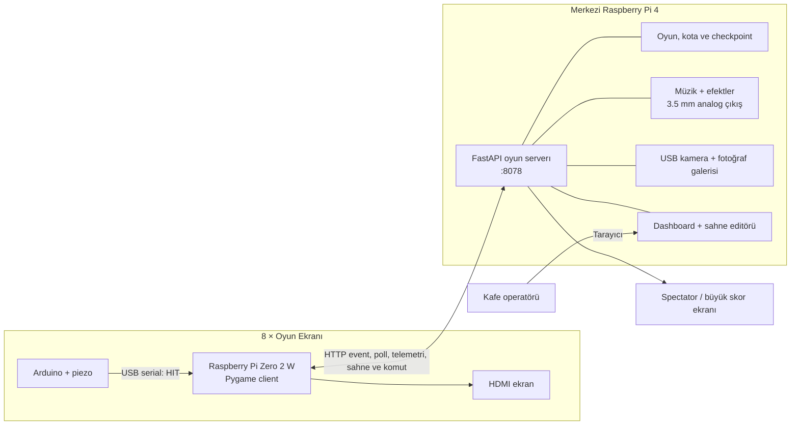

# Polis Oyunu

Sekiz fiziksel ekranda çalışan, cama yapılan vuruşları algılayan ve yaklaşık 30–40 dakikalık oyun oturumlarını merkezi olarak yöneten interaktif bir çocuk oyunu sistemi.

Her oyun ekranında bir Raspberry Pi Zero 2 W bulunur. Ekrana bağlı piezo/Arduino düzeneği vuruşları algılar, Pygame client hırsız animasyonunu oynatır ve geçerli isabetleri Raspberry Pi 4 servera gönderir. Pi4; oyun durumunu, ekran kotalarını, müziği, kamera çekimlerini, dashboardu, sahne editörünü ve güvenli client güncellemelerini yönetir.

> Bu README’ye Wi-Fi parolası, operatör PIN’i, Tailscale anahtarı, SSH özel anahtarı veya cihaz parolası yazmayın. Örneklerdeki `<...>` alanlarını kendi kurulumunuza göre doldurun.

## İçindekiler

- [Öne çıkan özellikler](#öne-çıkan-özellikler)
- [Sistem mimarisi](#sistem-mimarisi)
- [Oyun akışı](#oyun-akışı)
- [Donanım](#donanım)
- [Repository yapısı](#repository-yapısı)
- [Hızlı başlangıç](#hızlı-başlangıç)
- [Pi4 server kurulumu](#pi4-server-kurulumu)
- [Pi Zero client kurulumu](#pi-zero-client-kurulumu)
- [Spectator kurulumu](#spectator-kurulumu)
- [Dashboard ve operatör ekranları](#dashboard-ve-operatör-ekranları)
- [Sahne editörü](#sahne-editörü)
- [Ses ve kamera](#ses-ve-kamera)
- [Güncelleme sistemi](#güncelleme-sistemi)
- [Private repository geçişi](#private-repository-geçişi)
- [Config ve çalışma verileri](#config-ve-çalışma-verileri)
- [Testler](#testler)
- [Sorun giderme](#sorun-giderme)
- [Güvenlik ve veri yönetimi](#güvenlik-ve-veri-yönetimi)
- [Diğer belgeler](#diğer-belgeler)

## Öne çıkan özellikler

- Sekiz ekranın tamamı çocuk sayısından bağımsız olarak açık kalır.
- Her ekranın ayrı vurulması gereken hırsız kotası vardır.
- Kotalar çocuk sayısı ve zorluk profiline göre server tarafından dağıtılır.
- Bir ekran kotasını bitirdiğinde hırsızın hapiste olduğu jail sahnesine geçer.
- Eksik veya sonradan bağlanan clientlar oyunun başlamasını engellemez.
- Event ID tabanlı tekrar koruması aynı vuruşun iki kez sayılmasını önler.
- Ağ kesintilerinde client event kuyruğu bağlantı gelince tekrar gönderilebilir.
- Elektrik kesintisinde aktif oyun checkpoint üzerinden kurtarılır.
- Pi Zero 2 W için 720p, dirty-rect ve static-frozen render optimizasyonları bulunur.
- Dashboard sekiz clientın FPS, sıcaklık, RAM, render yolu ve update durumunu gösterir.
- Client ayarları kimlik/ağ alanları korunarak dashboarddan yayınlanabilir.
- Photoshop benzeri sahne editöründe sürükleme, çoklu seçim, timeline, prefab ve olay kuralları bulunur.
- Pi4 üzerinde merkezi müzik ve efekt sesleri çalışır.
- USB kamera, ekran kotası tamamlandığında fotoğraf çekebilir.
- Oturum fotoğrafları PIN korumalı galeriden görüntülenebilir ve indirilebilir.
- Clientlar dashboarddan allowlist tabanlı, atomik ve rollback destekli şekilde güncellenebilir.
- Server, client ve spectator systemd ile açılışta otomatik başlayabilir.

## Sistem mimarisi



### Bileşenler

| Bileşen | Görevi | Çalıştığı cihaz |
|---|---|---|
| `thief_server` | API, oyun oturumu, kota, skor, dashboard, ses, kamera, galeri ve sahne yayınlama | Raspberry Pi 4 |
| `thief_client` | Pygame render, seri vuruş okuma, event kuyruğu, telemetri ve sahne cache’i | 8 × Pi Zero 2 W |
| `thief_spectator` | Seyirci/merkezi skor görünümü | Pi4 veya ayrı ekran cihazı |
| `arduino` | Piezo sinyalini debounce ederek `HIT` mesajına dönüştürme | Arduino |
| `sd_card_tool` | Windows üzerinden Pi Zero SD kartı hazırlama | Operatör/geliştirici bilgisayarı |

### Varsayılan ağ modeli

- Pi4 hostname: `server`
- Server mDNS adresi: `server.local`
- Server portu: `8078`
- Client hostname örnekleri: `zero-1` … `zero-8`
- Oyun ağı: aynı LAN/Wi-Fi
- Uzaktan bakım: tercihen Tailscale + SSH

Clientlar mümkün olduğunda IP yerine şu adresi kullanır:

```text
http://server.local:8078
```

## Oyun akışı

1. Operatör hızlı başlatma veya dashboard ekranını açar.
2. Oturum adı ve çocuk sayısı girilir.
3. Server sekiz ekran için hedef hırsız sayılarını hesaplar.
4. Clientlarda bekleme sahnesi gösterilir.
5. Başlangıçta “HIRSIZLARI VUR” uyarısı, ardından 3–2–1 geri sayımı oynar.
6. Oyun aktif olduğunda hırsızlar ekranlarda hareket eder.
7. Arduino `HIT` ürettiğinde client isabet koşulunu değerlendirir.
8. Geçerli isabet benzersiz `event_id` ile servera gönderilir.
9. Server ekran skorunu, toplam skoru ve kalan kotayı günceller.
10. Ekran kotası tamamlanınca jail sahnesi açılır ve yapılandırılmışsa fotoğraf çekilir.
11. Sekiz ekranın hedefleri tamamlandığında veya süre dolduğunda sonuç sahnesi açılır.
12. Oturum verileri ve fotoğrafları dashboard üzerinden incelenebilir.

Bir client çevrimdışıysa diğer ekranlar çalışmaya devam eder. Client sonradan bağlandığında güncel oyun/sahne durumunu serverdan alır.

## Donanım

### Server

- Raspberry Pi 4, en az 2 GB RAM
- Raspberry Pi OS Bookworm veya uyumlu sürüm
- Ethernet veya kararlı 5/2.4 GHz ağ bağlantısı
- 3.5 mm analog ses çıkışı veya desteklenen USB ses kartı
- İsteğe bağlı USB kamera
- Yeterli ve kaliteli güç adaptörü

### Her client ekranı

- Raspberry Pi Zero 2 W
- microSD kart
- HDMI ekran
- Arduino
- Piezo sensör ve cam/pleksi vuruş düzeneği
- Arduino–Pi USB bağlantısı
- Kararlı güç adaptörü

### Önerilen client görüntü ayarı

- Fiziksel çıkış: `1280×720`
- Hedef FPS: `30`
- Profil: `pi_zero_2w`
- Kalite: `minimal`
- Render yolu: statik sahnede `static-frozen`, hareketli sahnede mümkünse `dirty-rect`

1080p çıkış Pi Zero 2 W üzerinde gereksiz ölçekleme ve yüksek P95 çizim süresi oluşturabilir.

## Repository yapısı

```text
PoliceGame2D/
├── arduino/                       # Piezo/Arduino kodları
├── sd_card_tool/                  # Windows SD kart hazırlama aracı
├── thief-1.0/                     # Kaynak hırsız sprite paketi ve lisansı
├── thief_client/                  # Pi Zero oyun clientı
│   ├── assets/                    # Client runtime görselleri
│   ├── lib/                       # Render, ağ, input ve oyun modülleri
│   ├── main.py                    # Client giriş noktası
│   ├── config.json                # Örnek client config’i
│   ├── setup_pi.sh                # İlk kurulum
│   ├── update_pi.sh               # Güvenli atomik updater
│   └── thief-game.service         # Systemd servis şablonu
├── thief_server/                  # Pi4 merkezi server
│   ├── main.py                    # FastAPI uygulaması
│   ├── config.json                # Örnek server config’i
│   ├── setup_server.sh            # Server kurulum scripti
│   └── backup_server.sh           # Günlük yedekleme
├── thief_spectator/               # Spectator görünümü
├── simulate.py                    # Yerel simülasyon aracı
├── DASHBOARD_GUIDE.md             # Dashboard kullanım kılavuzu
├── SCENE_EDITOR_GUIDE.md          # Sahne editörü kılavuzu
├── PRODUCTION.md                  # Production notları
└── SISTEM_KURULUM_VE_ISLETIM_REHBERI.md
```

## Hızlı başlangıç

### Geliştirme bilgisayarına klonlama

Repository public durumdayken:

```bash
git clone https://github.com/burakbagoglu/PoliceGame2D.git
cd PoliceGame2D
```

Repository private olduktan sonra SSH erişimi hazırlanmış bilgisayarda:

```bash
git clone git@github.com:burakbagoglu/PoliceGame2D.git
cd PoliceGame2D
```

### Python ortamı

Windows PowerShell:

```powershell
python -m venv .venv
.\.venv\Scripts\Activate.ps1
python -m pip install -r thief_server\requirements.txt
python -m pip install -r thief_client\requirements.txt
```

Linux/macOS:

```bash
python3 -m venv .venv
source .venv/bin/activate
python -m pip install -r thief_server/requirements.txt
python -m pip install -r thief_client/requirements.txt
```

### Serverı geliştirme modunda çalıştırma

```bash
cd thief_server
python main.py
```

Tarayıcı:

```text
http://localhost:8078/dashboard
```

### Simülasyon

Gerçek Pi/Arduino olmadan temel akışı denemek için:

```bash
python simulate.py
```

## Pi4 server kurulumu

Production için ayrıntılı ve güncel komutlar [Sistem Kurulum ve İşletim Rehberi](SISTEM_KURULUM_VE_ISLETIM_REHBERI.md) içinde tutulur. Aşağıdaki bölüm hızlı özettir.

### 1. Hostname

```bash
sudo hostnamectl set-hostname server
sudo sed -i 's/^127\.0\.1\.1.*/127.0.1.1\tserver/' /etc/hosts
```

Terminal istemi `<kullanıcı>@server` şeklinde görünür. Soldaki değer Linux kullanıcı adı, sağdaki değer hostname’dir.

### 2. Repository

```bash
mkdir -p "$HOME/Desktop"
cd "$HOME/Desktop"
git clone --depth 1 --single-branch --branch main \
  https://github.com/burakbagoglu/PoliceGame2D.git
cd PoliceGame2D/thief_server
```

### 3. Kurulum

```bash
chmod +x setup_server.sh backup_server.sh
bash setup_server.sh
```

Repo içindeki servis şablonu tarihsel olarak `User=pi` ve `/home/pi/thief_server` varsayar. Gerçek kullanıcı veya repository yolu farklıysa systemd override zorunludur. Örneğin kullanıcı `server` ise:

```ini
[Service]
User=server
WorkingDirectory=/home/server/Desktop/PoliceGame2D/thief_server
Environment=
Environment=PYTHONUNBUFFERED=1
Environment=THIEF_SERVER_CONFIG=/home/server/Desktop/PoliceGame2D/thief_server/config.json
Environment=SDL_AUDIODRIVER=alsa
EnvironmentFile=-/etc/police-game/photos.env
ExecStart=
ExecStart=/usr/bin/python3 -u /home/server/Desktop/PoliceGame2D/thief_server/main.py
Restart=always
RestartSec=3
```

Override oluşturmak için:

```bash
sudo systemctl edit thief-server.service
sudo systemctl daemon-reload
sudo systemctl enable thief-server.service
sudo systemctl restart thief-server.service
```

### 4. Kontrol

```bash
systemctl is-enabled thief-server.service
systemctl is-active thief-server.service
curl http://localhost:8078/health
sudo journalctl -b -u thief-server.service -n 60 --no-pager
```

Beklenen durum `enabled`, `active` ve health cevabında `"status":"healthy"` olmasıdır.

## Pi Zero client kurulumu

Her clientın farklı `screen_id` değeri vardır: `1`–`8`.

### Kaynak repository ile ilk kurulum

```bash
cd "$HOME"
git clone --depth 1 --single-branch --branch main \
  https://github.com/burakbagoglu/PoliceGame2D.git
cd PoliceGame2D/thief_client
```

Örnek ekran 1 kurulumu:

```bash
sudo bash setup_pi.sh \
  --screen-id 1 \
  --server server.local \
  --serial-port /dev/ttyUSB0 \
  --user "$(whoami)"
```

Diğer ekranlarda yalnız `--screen-id` değiştirilir.

Kurulum:

- Runtime dosyalarını `/opt/polisoyunu` altına kopyalar.
- Cihaza özel config’i oluşturur veya korur.
- `thief-game.service` servisini kurar.
- Kısıtlı uzaktan update helper ve servisini kurar.
- Kullanıcıyı gerekli donanım gruplarına ekler.
- Avahi/mDNS desteğini etkinleştirir.

`/opt/polisoyunu` içinde `.git` bulunmaması normaldir. Bu dizin source checkout değil, atomik olarak değiştirilen production release’tir.

### KMSDRM ve konsol modu

Pi Zero client doğrudan DRM/KMS ekranını kullanır. Masaüstü compositorü aynı ekranı tutarsa `kmsdrm not available` hatası oluşabilir.

```bash
sudo systemctl disable --now display-manager.service || true
sudo systemctl set-default multi-user.target
sudo reboot
```

### Client kontrolü

```bash
systemctl is-enabled thief-game.service
systemctl is-active thief-game.service
sudo journalctl -b -u thief-game.service -n 60 --no-pager
```

## Windows SD kart hazırlama aracı

`sd_card_tool`, Pi Zero 2 W kartlarını tek tek elle hazırlama yükünü azaltır.

```powershell
cd sd_card_tool
.\start_windows.bat
```

Araç genel olarak:

- Raspberry Pi OS imajını seçer/indirir.
- Çıkarılabilir SD kartı seçer.
- Hostname, ekran numarası ve server adresini ayarlar.
- Wi-Fi ve SSH ilk açılış ayarlarını hazırlar.
- Client kurulumunun ilk bootta tamamlanmasını sağlar.

Kart yazma işlemi hedef diskteki tüm verileri siler. Sistem diskini veya iç diski seçmeyin.

Ayrıntılar: [SD kart aracı README](sd_card_tool/README.md).

## Spectator kurulumu

Spectator merkezi skor ve oyun durumunu tam ekran gösterir. Pi4 üzerinde veya ayrı bir Raspberry Pi’de çalışabilir.

Ana giriş noktası:

```text
thief_spectator/screen.py
```

Config içinde server adresi `http://server.local:8078` olarak ayarlanabilir. Production servisinde `User`, `WorkingDirectory` ve `ExecStart` değerlerinin gerçek Linux kullanıcısına göre düzenlendiğini doğrulayın.

```bash
systemctl is-enabled thief-spectator.service
systemctl is-active thief-spectator.service
sudo journalctl -b -u thief-spectator.service -n 60 --no-pager
```

## Dashboard ve operatör ekranları

| Sayfa | Adres | Amaç |
|---|---|---|
| Dashboard | `/dashboard` | Oyun, clientlar, telemetri, ses, kamera ve ayarlar |
| Hızlı başlangıç | `/operator` | Kafe çalışanının oturumu birkaç adımda başlatması |
| Spectator web ekranı | `/screen` | Merkezi skor/seyirci görünümü |
| Sahne editörü | `/scene-editor` | Görsel sahne hazırlama ve yayınlama |
| Fotoğraf galerisi | `/photos` | Oturum ve fotoğraf yönetimi |
| Health | `/health` | Server çalışma ve ses durumu |

Yerel ağdan örnek:

```text
http://server.local:8078/dashboard
```

### Client telemetrisi

Dashboard her ekran için şunları gösterebilir:

- Bağlı/çevrimdışı durumu
- FPS ve P95 kare süresi
- P95 çizim, kopyalama ve flip süresi
- RAM ve sıcaklık
- Performans profili ve kalite seviyesi
- Render/çıkış çözünürlüğü
- Direct scaling durumu
- `static-frozen`, `dirty-rect` veya `full-render` yolu
- Güncellenen piksel oranı ve dirty bölge sayısı
- Seri port durumu
- Aktif sahne ve event kuyruğu
- Uygulama ve update sürümü

### Client ayarlarını yayınlama

Dashboardda render çözünürlüğü, FPS, kalite, adaptif kalite, oyun alanı, gölge ve benzeri izin verilen ayarlar düzenlenebilir.

Güvenlik nedeniyle aşağıdaki kimlik/ağ alanları uzaktan config yayınıyla değiştirilmez:

- `screen_id`
- `server_url`
- `server_base_url`
- `serial_port`

Bu alanları değiştirmek için ilgili clientta `setup_pi.sh` yeniden çalıştırılır.

Ayrıntılar: [Dashboard Kullanım Rehberi](DASHBOARD_GUIDE.md).

## Sahne editörü

Sahne editörü, Pygame client ekranlarını tarayıcıda görsel olarak tasarlamak için kullanılır.

Başlıca özellikler:

- Canvas üzerinde seçme, taşıma ve köşeden boyutlandırma
- Zoom, pan, ızgara ve hizalama çizgileri
- Çoklu seçim
- Katman kilitleme ve gizleme
- Gruplama ve prefab oluşturma
- Özel sahne oluşturma, kopyalama ve silme
- Timeline ve keyframe animasyonları
- Fade, slide ve zoom sahne geçişleri
- Skor, süre, isabet, kazanma ve kaybetme tetikleyicileri
- Merkezi ses timeline’ı
- Sprite-sheet animasyon ayarları
- Pi Zero performans bütçesi ve uyarılar
- Taslak kaydetme, önizleme, yayınlama ve sürüm geçmişi

Yayınlanan sahneler clientlar tarafından alınır ve yerel cache içinde tutulur. Ayrıntılar: [Sahne Editörü Rehberi](SCENE_EDITOR_GUIDE.md).

## Ses ve kamera

### Merkezi ses

Müzik ve efektler Pi4 üzerinden çalınır; client ekranlarında hoparlör gerekmez.

Pi4 analog çıkış kontrolü:

```bash
aplay -l
amixer scontrols
speaker-test -c 2 -t wav
```

Health çıktısında aşağıdaki alanlar kontrol edilir:

```bash
curl -s http://localhost:8078/health | python3 -m json.tool
```

- `audio.available: true`
- `audio.device_active`
- `audio.last_error: null`
- `using_fallback_music`
- `using_fallback_sfx`

`using_fallback_music: true`, özel müzik yüklenmediği ve sentetik yedek müziğin kullanıldığı anlamına gelir.

### USB kamera

```bash
v4l2-ctl --list-devices
ls -l /dev/video*
fswebcam --no-banner /tmp/kamera-test.jpg
```

Fotoğraf sistemi ekran kotası tamamlanınca çekim yapabilir. Oturum fotoğrafları Git’e girmez ve PIN korumalı galeride tutulur.

## Güncelleme sistemi

### Geliştirme bilgisayarından GitHub’a

Yalnız ilgili dosyaları stage edin:

```bash
git status
git diff --check
python -m pytest thief_client thief_server -q
git add <ilgili-dosyalar>
git commit -m "fix: kısa ve açıklayıcı mesaj"
git push origin main
```

Karışık çalışma ağacında bilinçsizce `git add -A` kullanmayın.

### Pi4 server güncellemesi

```bash
cd "$HOME/Desktop/PoliceGame2D"
git status
git pull --ff-only origin main
sudo systemctl restart thief-server.service
sudo systemctl restart thief-spectator.service
```

Production `config.json` dashboard tarafından değiştirilmiş olabilir. Pull öncesinde `git status` ve `git diff -- thief_server/config.json` kontrol edilmelidir; config körlemesine silinmemelidir.

### Client güvenli güncellemesi

Clientlarda doğrudan `/opt/polisoyunu` içinde `git pull` yapılmaz.

Dashboarddaki **Güvenli güncelle** düğmesi:

1. Clientın normal poll kanalına `update` komutu bırakır.
2. Client yalnız sabit allowlist helperını çalıştırır.
3. Root updater `main` dalından yalnız `thief_client/` paketini sparse clone ile indirir.
4. Zorunlu sprite ve Python dosyaları doğrulanır.
5. Cihaza özel config korunur.
6. Release atomik olarak `/opt/polisoyunu` altına geçirilir.
7. Client servisi 15 saniye boyunca kararlılık kontrolünden geçer.
8. Servis çöker veya yeniden başlarsa eski release geri yüklenir.
9. Başarılı sürüm `/var/lib/polisoyunu/update-status.json` içine yazılır.

Clientta kontrol:

```bash
cat /var/lib/polisoyunu/update-status.json
systemctl is-active thief-game.service
sudo journalctl -u thief-game-update.service -n 80 --no-pager
```

Sekiz clientı aynı anda güncellemek yerine önce bir clientta doğrulayın, ardından diğerlerini sırayla güncelleyin.

## Private repository geçişi

> **Kritik:** Mevcut client updater `https://github.com/burakbagoglu/PoliceGame2D.git` adresinden kimlik doğrulamasız clone yapar. Repository private yapıldığı anda dashboarddan güvenli client güncellemesi GitHub kimlik doğrulaması olmadığı için çalışmayı bırakır.

Repository’yi private yapmadan önce aşağıdaki kararlardan biri uygulanmalıdır.

### Önerilen model: Pi4 update dağıtıcısı

En güvenli saha mimarisi:

1. Yalnız Pi4 private GitHub repository’ye read-only deploy key ile erişir.
2. Pi4 güncel client release paketini indirir ve doğrular.
3. Clientlar paketi yalnız yerel `server.local` adresinden alır.
4. Paket checksum veya imza ile doğrulanır.
5. Sekiz Pi Zero üzerinde GitHub anahtarı/tokenı tutulmaz.

Bu model henüz mevcut GitHub-clone updater’ın davranışı değildir; private geçişten önce ayrıca uygulanmalıdır.

### Alternatif: Her cihaza read-only deploy key

Her clienta ayrı read-only deploy key verilebilir ve updater SSH URL kullanacak şekilde değiştirilebilir. Dezavantajları:

- Sekiz cihazda ayrı anahtar yönetimi gerekir.
- `known_hosts` güvenli biçimde hazırlanmalıdır.
- Bir cihaz kaybolursa ilgili deploy key GitHub’dan iptal edilmelidir.
- Mevcut updater hardcoded HTTPS URL kullandığı için kod değişikliği gerekir.

GitHub Personal Access Token’ı source code, config, systemd unit veya shell history içine yazmayın.

### Pi4 için read-only deploy key özeti

Pi4 üzerinde:

```bash
ssh-keygen -t ed25519 -f "$HOME/.ssh/polisoyunu_github" -C "polisoyunu-server"
cat "$HOME/.ssh/polisoyunu_github.pub"
```

Public anahtar GitHub repository ayarlarında read-only deploy key olarak eklenir. Özel anahtar Pi4 dışına çıkarılmaz.

`~/.ssh/config` örneği:

```sshconfig
Host github-polisoyunu
    HostName github.com
    User git
    IdentityFile ~/.ssh/polisoyunu_github
    IdentitiesOnly yes
```

Server repository remote’u:

```bash
cd "$HOME/Desktop/PoliceGame2D"
git remote set-url origin \
  git@github-polisoyunu:burakbagoglu/PoliceGame2D.git
ssh -T git@github-polisoyunu
git fetch origin main
```

### Private geçiş kontrol listesi

- [ ] Public geçmişte gerçek parola, PIN, token veya özel anahtar bulunmadığı doğrulandı.
- [ ] GitHub secret scanning sonuçları kontrol edildi.
- [ ] Pi4 için read-only repository erişimi hazırlandı.
- [ ] Geliştirme bilgisayarının SSH erişimi doğrulandı.
- [ ] Client update dağıtım yöntemi seçildi ve test edildi.
- [ ] Private geçişten önce tüm clientlar çalışan son public release’e güncellendi.
- [ ] Repository private yapıldıktan sonra Pi4 üzerinde `git fetch` test edildi.
- [ ] Bir test clientında sonraki update akışı doğrulandı.
- [ ] Eski veya sızmış olabilecek kimlik bilgileri iptal edildi.

Repository’yi private yapmak daha önce Git geçmişine yazılmış bir sırrı güvenli hale getirmez. Böyle bir durum varsa sır rotate edilmeli ve gerekirse Git geçmişinden temizlenmelidir.

## Config ve çalışma verileri

### Server

| Yol | İçerik | Git durumu |
|---|---|---|
| `thief_server/config.json` | Oyun, ses, kamera ve server ayarları | Takip edilir; production farkını pull öncesi kontrol edin |
| `thief_server/scene_data/` | Sahne taslakları, yayınlar, assetler ve sürümler | Takip edilmez |
| `thief_server/photo_sessions/` | Oturum fotoğrafları | Takip edilmez |
| `thief_server/runtime_state.json` | Aktif oyun checkpoint’i | Takip edilmez |
| `thief_server/client_settings.json` | Client config revizyonları | Takip edilmez |
| `/etc/police-game/photos.env` | Operatör PIN’i | Kesinlikle Git’e girmez |

### Client

| Yol | İçerik |
|---|---|
| `/opt/polisoyunu/thief_client/config.json` | Cihaza özel client ayarları |
| `/opt/polisoyunu/thief_client/scene_cache/` | Yayınlanan sahne asset cache’i |
| `/var/lib/polisoyunu/update-status.json` | Son güvenli update durumu |
| `/etc/polisoyunu-client-update.conf` | Updater hedef kullanıcı/install root bilgisi |
| `/etc/systemd/system/thief-game.service` | Client otomatik açılış servisi |

### Yedekleme

Pi4 üzerindeki `thief-server-backup.timer` günlük yedek üretir.

```bash
systemctl status thief-server-backup.timer --no-pager
sudo systemctl start thief-server-backup.service
sudo journalctl -u thief-server-backup.service -n 40 --no-pager
sudo ls -lh /var/backups/polisoyunu
```

Yedekler fotoğraf ve PIN içerebileceği için herkese açık ağ paylaşımına konulmamalıdır.

## Testler

### Tüm client ve server testleri

```bash
python -m pytest thief_client thief_server -q
```

### Yalnız client

```bash
python -m pytest thief_client -q
```

### Yalnız server

```bash
python -m pytest thief_server -q
```

### Saha kabul testi

- [ ] Sekiz ekran dashboardda doğru numarayla bağlı.
- [ ] Clientlar 720p çıkış ve beklenen FPS değerinde.
- [ ] Her piezo yalnız kendi ekranında isabet oluşturuyor.
- [ ] Wi-Fi kopup geldiğinde event kuyruğu boşalıyor.
- [ ] Bir client yeniden başladığında oyuna geri katılıyor.
- [ ] Eksik client oyunun başlamasını engellemiyor.
- [ ] Kota tamamlanınca doğru ekranda jail sahnesi açılıyor.
- [ ] Kamera doğru anda fotoğraf çekiyor.
- [ ] Müzik ve efektler analog çıkıştan duyuluyor.
- [ ] Fotoğraf galerisi PIN olmadan açılmıyor.
- [ ] Bir test clientında güvenli update ve rollback kontrol edildi.
- [ ] Pi4 yeniden başladığında server ve spectator otomatik açılıyor.
- [ ] Elektrik kesintisi simülasyonunda aktif oturum kurtarılıyor.
- [ ] En az 30–40 dakikalık tam oyun saha testi tamamlandı.

## Sorun giderme

### Server `217/USER`

Systemd unit içindeki `User=` hesabı cihazda yoktur.

```bash
whoami
systemctl show thief-server.service -p User -p WorkingDirectory -p ExecStart
```

Gerçek kullanıcı ve `/home/<kullanıcı>/...` yolu için systemd override oluşturun.

### Client `video system not initialized`

SDL video sürücüsü veya ekran oturumu doğru hazırlanmamıştır. Service environment içinde `SDL_VIDEODRIVER=kmsdrm` bulunduğunu ve HDMI/DRM cihazının mevcut olduğunu kontrol edin.

### Client `kmsdrm not available`

Masaüstü compositorü DRM cihazını tutuyor olabilir.

```bash
sudo systemctl disable --now display-manager.service || true
sudo systemctl set-default multi-user.target
sudo reboot
```

### Client sürekli yeniden başlıyor

```bash
systemctl status thief-game.service --no-pager -l
sudo journalctl -b -u thief-game.service -n 80 --no-pager
```

`systemctl is-active` restart döngüsünde kısa süre `active` gösterebilir. Journal ve `NRestarts` birlikte kontrol edilmelidir:

```bash
systemctl show thief-game.service -p NRestarts -p ActiveState -p SubState
```

### Sprite bulunamadı

Güncel release içinde şu dosya bulunmalıdır:

```text
/opt/polisoyunu/thief_client/assets/thief.png
```

Kontrol:

```bash
ls -lh /opt/polisoyunu/thief_client/assets/thief.png
```

`6119727` ve sonraki sürümlerde zorunlu sprite client paketinin içindedir.

### Client update `running` durumunda kaldı

```bash
cat /var/lib/polisoyunu/update-status.json
systemctl status thief-game-update.service --no-pager
sudo journalctl -u thief-game-update.service -n 100 --no-pager
```

Public repository döneminde en yaygın neden GitHub/Wi-Fi erişimidir. Private geçişten sonra kimlik doğrulama hazırlanmamışsa clone işlemi başarısız olur.

### `server.local` çözülmüyor

```bash
hostname
systemctl is-active avahi-daemon
getent hosts server.local
```

Gerekirse geçici olarak serverın LAN IP adresini kullanın; kalıcı çözüm mDNS/Avahi veya DHCP reservation olmalıdır.

### Ses az veya hiç yok

```bash
aplay -l
amixer scontrols
amixer get Master
speaker-test -c 2 -t wav
curl -s http://localhost:8078/health | python3 -m json.tool
```

Dashboard master/müzik/SFX seviyesi ile sistem ALSA seviyesi farklı katmanlardır. İkisinin de düşük olmadığını kontrol edin.

## Güvenlik ve veri yönetimi

- Operatör PIN’i `/etc/police-game/photos.env` içinde ve `0600` izinle tutulmalıdır.
- Fotoğraf klasörleri web server dışında doğrudan paylaşılmamalıdır.
- Dashboardun yönetim fonksiyonları güvenilmeyen internete port-forward edilmemelidir.
- Uzaktan bakım için doğrudan router portu açmak yerine Tailscale benzeri özel ağ tercih edilmelidir.
- Pi cihazlarında varsayılan veya ortak SSH parolası kullanılmamalıdır.
- Mümkünse SSH anahtar erişimi ve sınırlı sudo kuralları kullanılmalıdır.
- GitHub tokenı veya deploy private key repository’ye commit edilmemelidir.
- Private repository erişimi her cihaz için en az yetkiyle verilmelidir.
- Kaybolan/servisten çıkan cihazların deploy key’i ve Tailscale erişimi iptal edilmelidir.
- Fotoğraf saklama ve silme politikası işletmenin açık prosedürüne göre belirlenmelidir.
- Production yedeklerinin geri yükleme testi düzenli yapılmalıdır.

## Geliştirme notları

- Client render yolunda kare başına yeni büyük `Surface` üretmekten kaçının.
- Görselleri yüklerken mümkün olduğunda `convert()`/`convert_alpha()` ile önceden dönüştürün.
- Statik sahnelerde `static-frozen`, sınırlı hareketlerde dirty rect kullanın.
- Ağ ve serial I/O ana render döngüsünü bloklamamalıdır.
- Client kimliği ve server adresi environment/config ayrımına dikkat edilerek değiştirilmelidir.
- Server eventleri idempotent olmalı; aynı `event_id` ikinci kez skor üretmemelidir.
- Production verilerini test fixture veya Git commit’i içine koymayın.
- Yeni updater değişikliklerinde atomik release, config koruma ve rollback testleri zorunludur.

## Asset ve lisans notu

`thief-1.0/` altındaki üçüncü taraf sprite paketinin kendi `LICENSE.txt` ve kaynak notları vardır. Assetleri dağıtmadan veya ticari ortamda kullanmadan önce ilgili lisans dosyalarını inceleyin.

Repository kökünde proje geneline ait ayrı bir lisans dosyası yoksa kodun kullanım/dağıtım hakları hakkında varsayım yapmayın; proje sahibi tarafından açık bir lisans eklenmelidir.

## Diğer belgeler

- [Detaylı Sistem Kurulum ve İşletim Rehberi](SISTEM_KURULUM_VE_ISLETIM_REHBERI.md)
- [Dashboard Kullanım Rehberi](DASHBOARD_GUIDE.md)
- [Sahne Editörü Kullanım Rehberi](SCENE_EDITOR_GUIDE.md)
- [Production Notları](PRODUCTION.md)
- [SD Kart Hazırlama Aracı](sd_card_tool/README.md)

## Günlük hızlı kontrol

Pi4:

```bash
systemctl is-active thief-server.service
systemctl is-active thief-spectator.service
curl -s http://localhost:8078/health | python3 -m json.tool
```

Bir client:

```bash
systemctl is-active thief-game.service
cat /var/lib/polisoyunu/update-status.json
sudo journalctl -b -u thief-game.service -n 20 --no-pager
```

Operatör:

```text
http://server.local:8078/operator
```

Teknik dashboard:

```text
http://server.local:8078/dashboard
```
